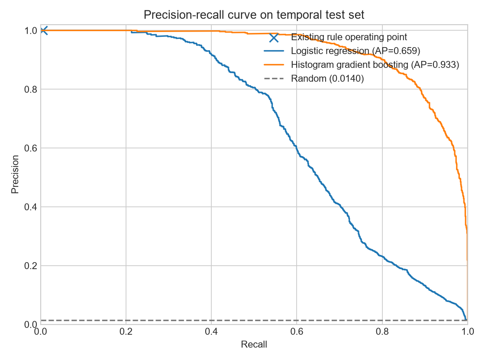
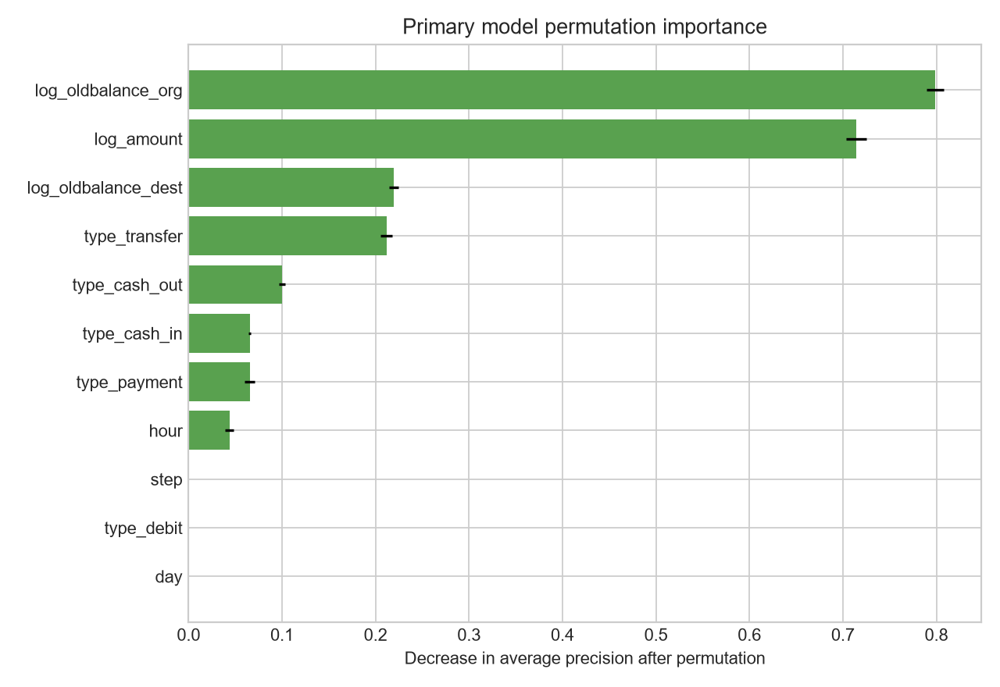

# Fraudulent Transaction Detection

An end-to-end machine learning project for detecting fraudulent mobile-money transactions before
they are completed. It uses the highly imbalanced
[PaySim dataset on Kaggle](https://www.kaggle.com/datasets/chitwanmanchanda/fraudulent-transactions-data)
and emphasizes reproducibility, temporal validation, decision-threshold selection, and strict
feature availability.

## Results

The primary histogram gradient-boosting model was evaluated on the final 112 time steps, which
were never used for fitting or threshold selection. Its threshold was selected on a separate
validation period by maximizing F2, placing more weight on missed fraud than on false alerts.

| Model | Average precision | Precision | Recall | F2 | False positives | Missed fraud |
| --- | ---: | ---: | ---: | ---: | ---: | ---: |
| Existing `isFlaggedFraud` rule | 0.0195 | 1.0000 | 0.0056 | 0.0070 | 0 | 1,245 |
| Logistic regression | 0.6585 | 0.5329 | 0.6334 | 0.6104 | 695 | 459 |
| **Histogram gradient boosting** | **0.9331** | **0.8231** | **0.8770** | **0.8657** | **236** | **154** |

The test set contains 89,466 transactions, including 1,252 fraud cases. Accuracy is deliberately
not the headline metric: a model predicting every transaction as legitimate would appear highly
accurate on data where only 0.1291% of all transactions are fraudulent.



Detailed outputs are available in the [model card](artifacts/model_card.md),
[metrics JSON](artifacts/metrics.json), and [model comparison](artifacts/model_comparison.csv).

## Feature availability

The model uses only information available before transaction completion: time step, transaction
type, requested amount, sender's starting balance, and recipient's starting balance. It explicitly
excludes `newbalanceOrig`, `newbalanceDest`, all features derived from them, account identifiers,
the target, and the existing fraud flag.



Starting sender balance and requested amount are the strongest predictors, followed by starting
recipient balance and transaction type. PaySim's generated fraud behavior is relatively regular,
so even this leakage-conscious result should not be interpreted as expected production performance.

Permutation importance measures predictive contribution, not causality.

## Methodology

- **Target:** `isFraud`, where `1` indicates fraud and `0` a legitimate transaction.
- **Prediction point:** before transaction completion; post-transaction balances are never loaded
  into the modeling dataframe.
- **Temporal validation:** steps 1-520 for training, 521-631 for validation, and 632-743 for testing.
- **Imbalance handling:** retain every training fraud case, sample legitimate cases up to a
  one-million-row training set, and correct for sampling with observation weights.
- **Models:** the existing transfer rule, logistic regression, and histogram gradient boosting.
- **Threshold:** chosen once on validation data to maximize F2, then frozen for the test set.
- **Metrics:** average precision, ROC-AUC, precision, recall, F1/F2, balanced accuracy, and the
  complete confusion matrix.
- **Interpretability:** model-agnostic permutation importance measured by average precision.

Account identifiers are excluded to prevent customer memorization. `isFlaggedFraud` is kept out of
the learned models and evaluated independently as the current business-rule baseline.

## Reproduce the analysis

The project uses Python 3.12 and [uv](https://docs.astral.sh/uv/) for a locked environment.

```bash
uv sync --extra dev
uv run fraud-download
uv run fraud-train
```

The download command places `Fraud.csv` in `data/`. The training command regenerates the metrics,
figures, model card, feature importance, and serialized model under `artifacts/`. Raw data and model
binaries are intentionally excluded from Git.

Run the quality checks with:

```bash
uv run ruff check .
uv run pytest
```

The exploratory [notebook](notebooks/eda.ipynb) provides a compact introduction. All modeling logic
lives in the package rather than the notebook so that it can be tested and reused.

## Repository structure

```text
.
|-- artifacts/              # Versioned metrics, plots, and model card
|-- data/                   # Local dataset (ignored by Git)
|-- notebooks/eda.ipynb     # Lightweight exploratory analysis
|-- src/fraud_detection/    # Data, feature, model, evaluation, and CLI code
|-- tests/                  # Unit tests
|-- .github/workflows/      # Continuous integration
|-- pyproject.toml          # Package and tool configuration
`-- uv.lock                 # Reproducible dependency resolution
```

## Business implications

The existing rule is precise but detects only 7 of 1,252 test-period fraud cases. A layered process
should use model scores to prioritize review, retain deterministic rules as guardrails, and focus
controls on `TRANSFER` and `CASH_OUT`, the only transaction types containing fraud in this dataset.
Production monitoring should track precision, recall, alert volume, financial value recovered,
review cost, latency, and drift by transaction type and time period.

## Limitations

- This is synthetic mobile-money data, not evidence of real-world deployment performance.
- PaySim's simulated fraud patterns may be substantially easier to learn than real fraud behavior.
- A production system must verify that starting balances are current and available at decision time.
- The data contains no investigation cost or fraud-loss value, so F2 is a transparent proxy rather
  than a financially optimized threshold.
- The late test period has a higher fraud prevalence than the full dataset; random cross-validation
  would conceal this temporal shift.
- Before deployment, the model would require probability calibration, stress testing, fairness and
  privacy review, drift monitoring, and validation on representative production data.

## Data and attribution

The Kaggle data card lists 6,362,620 rows and a CC0 public-domain license. The data originates from
the PaySim mobile-money simulator described by E. A. Lopez-Rojas, A. Elmir, and S. Axelsson in
*[PaySim: A Financial Mobile Money Simulator for Fraud Detection](https://www.msc-les.org/proceedings/emss/2016/EMSS2016_249.pdf)*,
28th European Modeling and Simulation Symposium, 2016.
